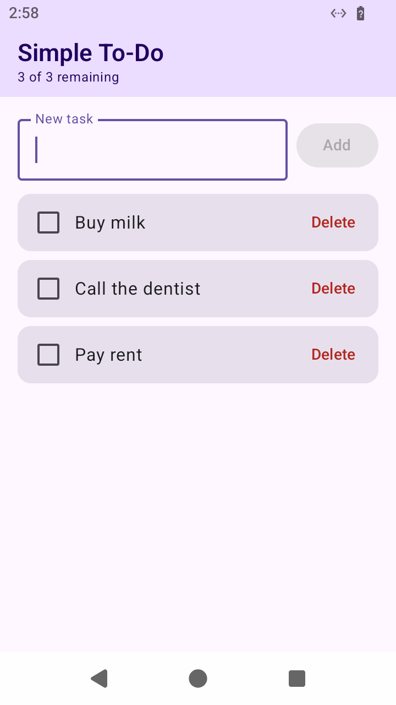
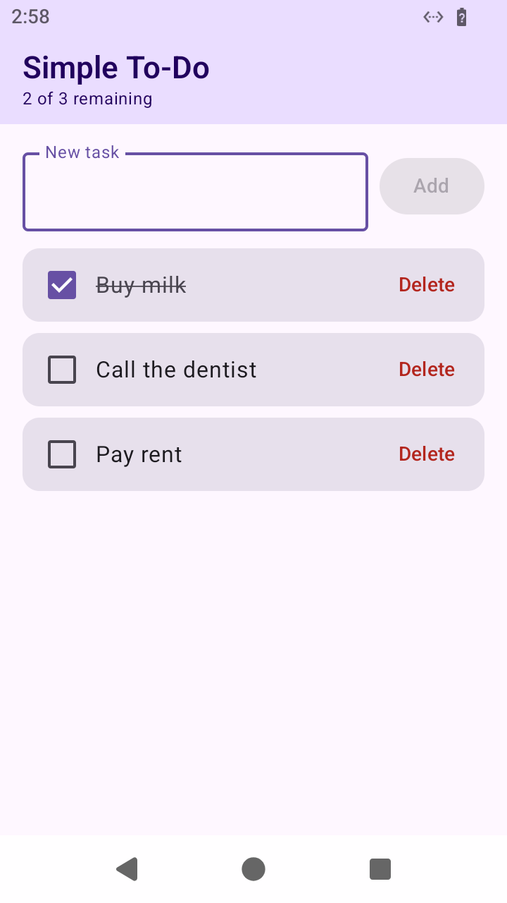
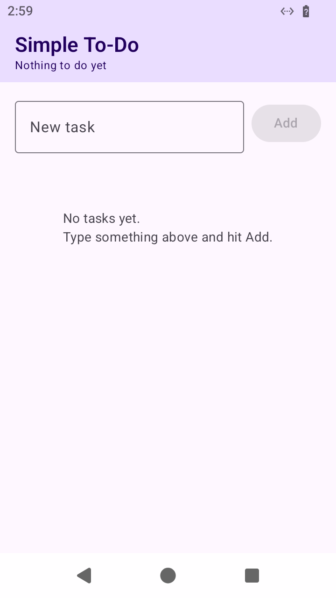

# Simple To-Do (Android, Kotlin)

A single-screen to-do list. Add a task, tick it off, delete it. No login, no accounts, no network.

<p align="center">
  
  
  
</p>

## What it does

- **Add** — type in the field, tap **Add** (or hit Done on the keyboard). Blank input is ignored and the Add button stays disabled until you type something.
- **Complete** — tap the checkbox. The task greys out with a strikethrough; tap again to un-complete.
- **Delete** — tap **Delete** on the row. Gone immediately.
- The header shows a live count (`2 of 3 remaining`).
- Tasks survive closing and reopening the app — they're saved to `SharedPreferences` as JSON.

## Stack

| | |
|---|---|
| Language | Kotlin 2.3.20 |
| UI | Jetpack Compose + Material 3 |
| Architecture | `AndroidViewModel` + `StateFlow`, single `Activity` |
| minSdk / targetSdk / compileSdk | 24 / 35 / 36 |
| Build | Gradle 9.7.1, AGP 9.0.1, JDK 17 target |

No Room, no Hilt, no networking — the whole app is four small files.

## Project layout

```
app/src/main/java/com/talmale/todo/
├── MainActivity.kt      # the single screen: Compose UI
├── TodoViewModel.kt     # add / toggle / delete, exposes StateFlow<List<Task>>
└── TodoRepository.kt    # Task model + SharedPreferences JSON persistence
```

## Install the APK

Grab `app-debug.apk` from the [Releases](../../releases) page (or build it yourself, below), copy it to your phone and open it. Android will ask you to allow installs from unknown sources — that's expected for any APK not coming from the Play Store.

Or over USB with adb:

```bash
adb install -r app-debug.apk
```

It's signed with the standard Android debug key, which is fine for sideloading. For Play Store distribution you'd sign a release build with your own keystore.

## Build from source

Requires a **JDK** (not just a JRE) and the Android SDK with platform 36.

```bash
git clone https://github.com/anirudhatalmale8-eng/simple-todo-android.git
cd simple-todo-android
echo "sdk.dir=/path/to/your/android-sdk" > local.properties
./gradlew assembleDebug
```

Output lands at `app/build/outputs/apk/debug/app-debug.apk`.

## Tested on

Android 15 (API 35), 720x1280 @ 320dpi. Every screenshot in `screenshots/` was captured from that running device via `adb exec-out screencap`. See [`screenshots/TEST-RUN.md`](screenshots/TEST-RUN.md) for the step-by-step run.
